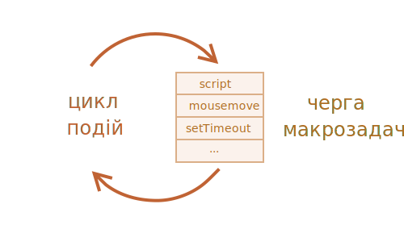

# Цикл подій: мікрозадачі та макрозадачі

Потік виконання JavaScript у браузері, так само як і в Node.js, базується на *циклі подій*.

Розуміння того, як працює цикл подій є важливим для оптимізації, а іноді для правильної архітектури.

У цьому розділі ми спочатку розглядаємо теоретичні деталі того, як все працює, а потім побачимо практичне застосування цих знань.

## Цикл подій

Концепція *циклу подій* дуже проста. Існує нескінченний цикл, у якому рушій JavaScript чекає на завдання, виконує їх, а потім перебуває в режимі сну, очікуючи на нові завдання.

Загальний алгоритм роботи рушія:

1. Поки є завдання:
    - виконуй їх, починаючи з найстарішого завдання.
2. Очікуй в режимі сну допоки не з'явиться нове завдання, дали йди до першого пункту

Це формалізація того, що ми бачимо під час перегляду сторінки. Рушій JavaScript нічого не робить більшість часу, він запускається, лише якщо активується скрипт/обробник/подія.

Приклади завдань:

- Коли завантажується зовнішній скрипт `<script src="...">`, завдання полягає в тому, щоб виконати його.
- Коли користувач рухає мишкою, завдання полягає в тому, щоб відправити подію `mousemove` і виконати обробники.
- Коли настає час для запланованого `setTimeout`, завдання полягає в тому, щоб запустити його колбек.
- ...і так далі.

Завдання встановлюються — система їх обробляє — потім чекає на інші завдання (під час сну центральний процесор майже не навантажується).

Може статися так, що завдання приходить, коли рушій зайнятий, тоді вона стає в чергу.

Завдання утворюють чергу, так звану "чергу макрозадач" (macrotask queue, v8 термін).



Наприклад, коли рушій зайнятий виконанням `script`, користувач може рухати мишкою, викликаючи подію `mousemove`, і може настати `setTimeout` і так далі, ці завдання утворюють чергу, як показано на малюнку вище.

Завдання з черги обробляються за принципом "перший прийшов – першим виконано". Коли рушій браузера завершує роботу з `script`, він обробляє подію `mousemove`, потім обробник `setTimeout` і так далі.

Поки що досить просто, чи не так?

Ще дві деталі:
1. Візуалізація ніколи не відбувається, поки рушій виконує завдання. Не має значення, якщо завдання займає багато часу. Зміни в DOM малюються тільки після того як завдання виконано.
2. Якщо завдання виконується задовго, в цей самий час браузер не зможе виконувати інші завдання, наприклад обробку подій користувача. Тож через деякий час з’являється сповіщення на кшталт "Сторінка не відповідає", пропонуючи завершити завдання разом із усією сторінкою. Це може трапитись, коли є багато складних обчислень або помилка програмування, що призводить до нескінченного циклу.

Це була теорія. Тепер давайте подивимося, як ми можемо застосувати ці знання.

## Випадок використання 1: поділ енергоємної задачі.

Скажімо в нас є "тяжка" для центрального процесора задача.

Наприклад, підсвічування синтаксису (використовується для розфарбовування прикладів коду на цій сторінці) це досить сильно навантажує ЦП. Щоб виділити код, він виконує аналіз, створює багато кольорових елементів, додає їх до документа сторінки — для великого обсягу тексту це займе багато часу.

While the engine is busy with syntax highlighting, it can't do other DOM-related stuff, process user events, etc. It may even cause the browser to "hiccup" or even "hang" for a bit, which is unacceptable.

We can avoid problems by splitting the big task into pieces. Highlight first 100 lines, then schedule `setTimeout` (with zero-delay) for the next 100 lines, and so on.

To demonstrate this approach, for the sake of simplicity, instead of text-highlighting, let's take a function that counts from `1` to `1000000000`.

If you run the code below, the engine will "hang" for some time. For server-side JS that's clearly noticeable, and if you are running it in-browser, then try to click other buttons on the page -- you'll see that no other events get handled until the counting finishes.

```js run
let i = 0;

let start = Date.now();

function count() {

  // do a heavy job
  for (let j = 0; j < 1e9; j++) {
    i++;
  }

  alert("Done in " + (Date.now() - start) + 'ms');
}

count();
```

The browser may even show a "the script takes too long" warning.

Let's split the job using nested `setTimeout` calls:

```js run
let i = 0;

let start = Date.now();

function count() {

  // do a piece of the heavy job (*)
  do {
    i++;
  } while (i % 1e6 != 0);

  if (i == 1e9) {
    alert("Done in " + (Date.now() - start) + 'ms');
  } else {
    setTimeout(count); // schedule the new call (**)
  }

}

count();
```

Now the browser interface is fully functional during the "counting" process.

A single run of `count` does a part of the job `(*)`, and then re-schedules itself `(**)` if needed:

1. First run counts: `i=1...1000000`.
2. Second run counts: `i=1000001..2000000`.
3. ...and so on.

Now, if a new side task (e.g. `onclick` event) appears while the engine is busy executing part 1, it gets queued and then executes when part 1 finished, before the next part. Periodic returns to the event loop between `count` executions provide just enough "air" for the JavaScript engine to do something else, to react to other user actions.

The notable thing is that both variants -- with and without splitting the job by `setTimeout` -- are comparable in speed. There's not much difference in the overall counting time.

To make them closer, let's make an improvement.

We'll move the scheduling to the beginning of the `count()`:

```js run
let i = 0;

let start = Date.now();

function count() {

  // move the scheduling to the beginning
  if (i < 1e9 - 1e6) {
    setTimeout(count); // schedule the new call
  }

  do {
    i++;
  } while (i % 1e6 != 0);

  if (i == 1e9) {
    alert("Done in " + (Date.now() - start) + 'ms');
  }

}

count();
```

Now when we start to `count()` and see that we'll need to `count()` more, we schedule that immediately, before doing the job.

If you run it, it's easy to notice that it takes significantly less time.

Why?  

That's simple: as you remember, there's the in-browser minimal delay of 4ms for many nested `setTimeout` calls. Even if we set `0`, it's `4ms` (or a bit more). So the earlier we schedule it - the faster it runs.

Finally, we've split a CPU-hungry task into parts - now it doesn't block the user interface. And its overall execution time isn't much longer.

## Use case 2: progress indication

Another benefit of splitting heavy tasks for browser scripts is that we can show progress indication.

As mentioned earlier, changes to DOM are painted only after the currently running task is completed, irrespective of how long it takes.

On one hand, that's great, because our function may create many elements, add them one-by-one to the document and change their styles -- the visitor won't see any "intermediate", unfinished state. An important thing, right?

Here's the demo, the changes to `i` won't show up until the function finishes, so we'll see only the last value:


```html run
<div id="progress"></div>

<script>

  function count() {
    for (let i = 0; i < 1e6; i++) {
      i++;
      progress.innerHTML = i;
    }
  }

  count();
</script>
```

...But we also may want to show something during the task, e.g. a progress bar.

If we split the heavy task into pieces using `setTimeout`, then changes are painted out in-between them.

This looks prettier:

```html run
<div id="progress"></div>

<script>
  let i = 0;

  function count() {

    // do a piece of the heavy job (*)
    do {
      i++;
      progress.innerHTML = i;
    } while (i % 1e3 != 0);

    if (i < 1e7) {
      setTimeout(count);
    }

  }

  count();
</script>
```

Now the `<div>` shows increasing values of `i`, a kind of a progress bar.


## Use case 3: doing something after the event

In an event handler we may decide to postpone some actions until the event bubbled up and was handled on all levels. We can do that by wrapping the code in zero delay `setTimeout`.

In the chapter <info:dispatch-events> we saw an example: custom event `menu-open` is dispatched in `setTimeout`, so that it happens after the "click" event is fully handled.

```js
menu.onclick = function() {
  // ...

  // create a custom event with the clicked menu item data
  let customEvent = new CustomEvent("menu-open", {
    bubbles: true
  });

  // dispatch the custom event asynchronously
  setTimeout(() => menu.dispatchEvent(customEvent));
};
```

## Macrotasks and Microtasks

Along with *macrotasks*, described in this chapter, there are *microtasks*, mentioned in the chapter <info:microtask-queue>.

Microtasks come solely from our code. They are usually created by promises: an execution of `.then/catch/finally` handler becomes a microtask. Microtasks are used "under the cover" of `await` as well, as it's another form of promise handling.

There's also a special function `queueMicrotask(func)` that queues `func` for execution in the microtask queue.

**Immediately after every *macrotask*, the engine executes all tasks from *microtask* queue, prior to running any other macrotasks or rendering or anything else.**

For instance, take a look:

```js run
setTimeout(() => alert("timeout"));

Promise.resolve()
  .then(() => alert("promise"));

alert("code");
```

What's going to be the order here?

1. `code` shows first, because it's a regular synchronous call.
2. `promise` shows second, because `.then` passes through the microtask queue, and runs after the current code.
3. `timeout` shows last, because it's a macrotask.

The richer event loop picture looks like this (order is from top to bottom, that is: the script first, then microtasks, rendering and so on):


All microtasks are completed before any other event handling or rendering or any other macrotask takes place.

That's important, as it guarantees that the application environment is basically the same (no mouse coordinate changes, no new network data, etc) between microtasks.

If we'd like to execute a function asynchronously (after the current code), but before changes are rendered or new events handled, we can schedule it with `queueMicrotask`.

Here's an example with "counting progress bar", similar to the one shown previously, but `queueMicrotask` is used instead of `setTimeout`. You can see that it renders at the very end. Just like the synchronous code:

```html run
<div id="progress"></div>

<script>
  let i = 0;

  function count() {

    // do a piece of the heavy job (*)
    do {
      i++;
      progress.innerHTML = i;
    } while (i % 1e3 != 0);

    if (i < 1e6) {
  *!*
      queueMicrotask(count);
  */!*
    }

  }

  count();
</script>
```

## Summary

A more detailed event loop algorithm (though still simplified compared to the [specification](https://html.spec.whatwg.org/multipage/webappapis.html#event-loop-processing-model)):

1. Dequeue and run the oldest task from the *macrotask* queue (e.g. "script").
2. Execute all *microtasks*:
    - While the microtask queue is not empty:
        - Dequeue and run the oldest microtask.
3. Render changes if any.
4. If the macrotask queue is empty, wait till a macrotask appears.
5. Go to step 1.

To schedule a new *macrotask*:
- Use zero delayed `setTimeout(f)`.

That may be used to split a big calculation-heavy task into pieces, for the browser to be able to react to user events and show progress between them.

Also, used in event handlers to schedule an action after the event is fully handled (bubbling done).

To schedule a new *microtask*
- Use `queueMicrotask(f)`.
- Also promise handlers go through the microtask queue.

There's no UI or network event handling between microtasks: they run immediately one after another.

So one may want to `queueMicrotask` to execute a function asynchronously, but within the environment state.

```smart header="Web Workers"
For long heavy calculations that shouldn't block the event loop, we can use [Web Workers](https://html.spec.whatwg.org/multipage/workers.html).

That's a way to run code in another, parallel thread.

Web Workers can exchange messages with the main process, but they have their own variables, and their own event loop.

Web Workers do not have access to DOM, so they are useful, mainly, for calculations, to use multiple CPU cores simultaneously.
```
